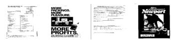

# Introduction
 
Document classification is an essential building block of many machine learning applications,
and therefore important. The authors of the paper *ICDAR-2015 paper* [deepdocclassifier](https://ieeexplore.ieee.org/document/7333933/) have therefore taken the challenge to improve the
state of art performance (back in 2015) of document classification. Their method is different to existing solutions as they use deep convolutional networks and base their classification only on visual aspects.
 
This Repository reimplements the methods in the paper.
 
 
# Getting Started
 
## Installation
      pip install -r requirements.txt
 
Please use the [getting started](DeepDocClassifier-Getting-Started.ipynb) notebook to run
the experiments
 
# DataSet
 
The *Tobacco3482* data set consists **3482** different documents. Every document
has an assigned category (class label), and there are a total of **10** different class labels.
Theses class labels are:
* Note, Scientific, Form, Report, ADVE, Memo, Resume, Email, News, Letter
 
Examples:
 

 
# Model
 
The DeepDocClassifier is based on a pretrained *AlexNet*, that was initially trained on imagenet (1000 classes). To adapt the network for Tobacco3482 dataset we have to change the last layer of the *AlexNet* and replace it with a fully connected layer that has only 10 hidden units.
 
My reimplementation of the model ([DeepDocClassifier](files/model.py)) swaps the last layer of the *AlexNet* and replaces it with a fully connected layer that has only 10 hidden units.

